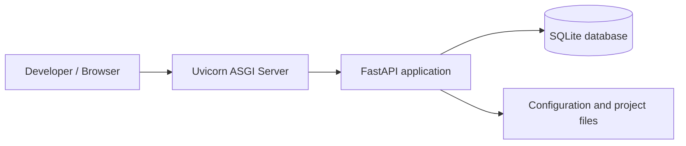

# QA Exam CRM Pack (FastAPI + SQLite)

Repository: https://github.com/hryak007-arch/qa-exam-crm-pack

Цей репозиторій містить пакет матеріалів для екзамену з дисципліни **«Забезпечення якості програмних продуктів»** (2–3 відомості) на основі бакалаврського проєкту: **веб-CRM для майстерні ремонту електроніки**.

## 1) Що всередині (структура)
- **bestimt arbeit/** — код мінімальної CRM (FastAPI + SQLite + SQLAlchemy + Pydantic), який використовується для демонстрації тестування
- **tests/** — інтеграційні тести **pytest + FastAPI TestClient** (clients / orders / reports)
- **scripts/** — скрипти підготовки даних:
  - `seed.py` — наповнення тестовими даними
  - `cleanup.py` — очищення/видалення тестових даних (або БД)
- **reports/** — результати SAST:
  - `bandit.txt`
  - `semgrep.txt`
- **requirements.txt** — залежності застосунку
- **requirements-dev.txt** — залежності для тестування/аналізаторів (pytest, pytest-cov, bandit, semgrep)
- **захист.docx** — звіт/матеріали для захисту

>## Developer quick start

### Project overview
This project is a minimal CRM web application based on:
- **FastAPI** as the application server;
- **Uvicorn** as the ASGI server;
- **SQLite** as the database;
- local file-based project structure without a separate cache layer.

### Architecture


### Required software
- Git
- Python 3.11 or newer
- pip
- virtual environment module (`venv`)

### Setup from scratch
```bash
git clone https://github.com/hryak007-arch/qa-exam-crm-pack
cd qa-exam-crm-pack/"bestimt arbait"
python -m venv .venv
```

#### Windows PowerShell
```powershell
.\.venv\Scripts\Activate.ps1
```

#### Git Bash / Linux
```bash
source .venv/Scripts/activate
```

### Install dependencies
```bash
pip install -r requirements.txt
pip install -r requirements-dev.txt
```

### Database preparation
The project uses SQLite. The database file is created locally during first run if it does not exist.
If test data is needed:
```bash
python ..\scripts\seed.py
```

### Run project in development mode
```bash
uvicorn app.main:app --reload
```

Open:
- API root: `http://127.0.0.1:8000`
- Swagger UI: `http://127.0.0.1:8000/docs`

### Basic commands
```bash
pytest -q
python ..\scripts\cleanup.py
python ..\scripts\check_quality.py
```


